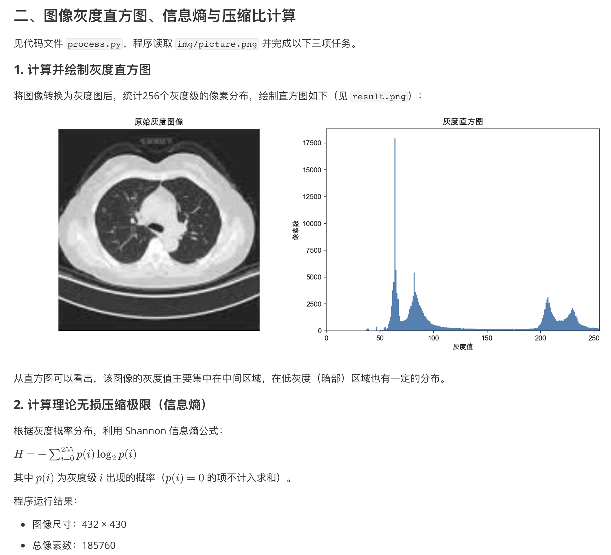
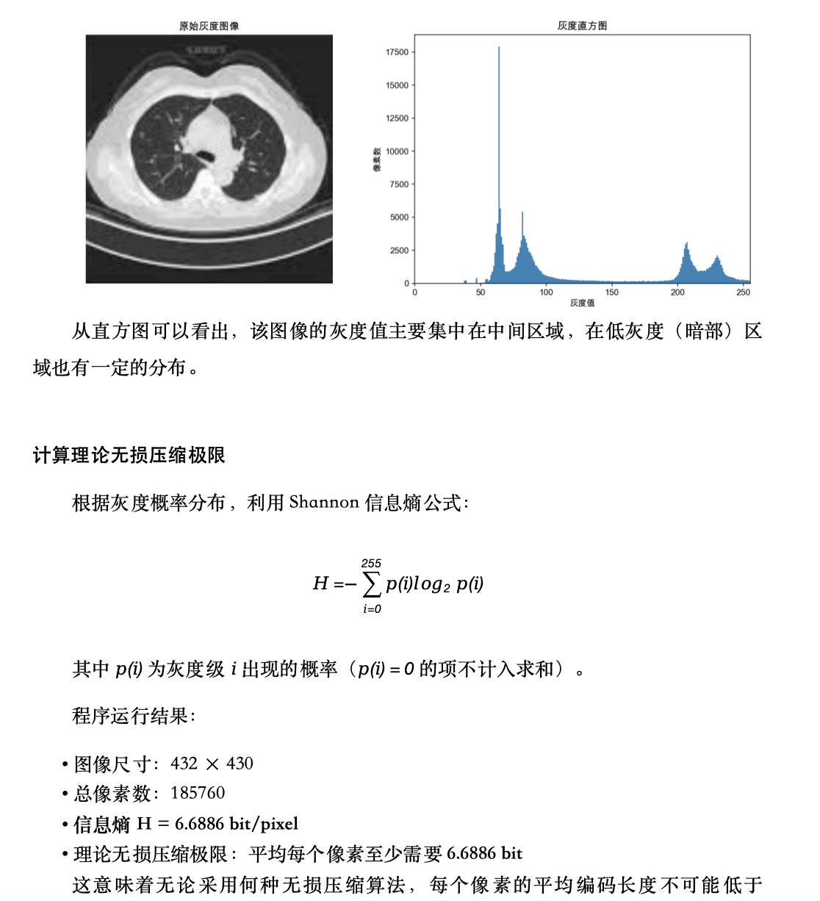

# w2w

将 Markdown 文档转换为 Word（DOCX）文件，支持 LaTeX 数学公式渲染为 Word 原生公式。

## 功能特性

- **LaTeX 数学公式** — 将 `$...$` 和 `$$...$$` 渲染为 Word 原生公式（OMML），无法转换时降级为 Unicode 文本
- **完整 Markdown 支持** — 标题、段落、加粗、斜体、删除线、行内代码、代码块、引用、有序/无序列表、表格、分割线
- **图片支持** — 支持本地绝对路径、相对路径和网络图片（HTTP/HTTPS）
- **自定义排版** — 可配置字体、字号、行高和标题样式
- **命令行与 API 双模式** — 既可作为命令行工具使用，也可作为 Node.js 库调用

## 安装

```bash
npm install @clipg/w2w
```

## 命令行使用

```bash
# 全局安装
npm install -g @clipg/w2w

# 转换文件
w2w document.md
w2w input.md output.docx
```

默认输出与输入文件同名、扩展名为 `.docx` 的文件。

## Skill

### 安装

```bash
npx skills add CliPg/md2word
```

安装后在 Claude Code 中直接描述排版需求即可，例如：

```
把 demo.md 转成 Word，格式要求：
- 标题：三号黑体
- 题目：五号黑体，深蓝色
- 正文：五号宋体，黑色
- 全文：1.5 倍行间距，段前 0.5 行
```

Skill 会自动将中文字号、字体、颜色映射为 `FormatSettings` 并执行转换。

## 效果展示
md文件：

转换后的word文件：


## 编程接口

### 基本用法

```typescript
import { convertMdToDocx } from '@clipg/w2w';
import * as fs from 'fs';

const md = fs.readFileSync('document.md', 'utf-8');
const buffer = await convertMdToDocx(md, {
  sourceFilePath: '/path/to/document.md', // 用于解析相对路径图片
});
fs.writeFileSync('document.docx', buffer);
```

### 自定义排版

```typescript
import { convertMdToDocx } from '@clipg/w2w';

const buffer = await convertMdToDocx(md, {
  formatSettings: {
    paragraph: {
      fontFamily: '宋体',
      fontSize: 12,
      lineHeight: 1.5,
      paragraphSpacing: 6,
      firstLineIndent: 2,
    },
    heading1: {
      fontFamily: '黑体',
      fontSize: 22,
      lineHeight: 1.5,
      alignment: 'center',
      spacingBefore: 12,
      spacingAfter: 12,
    },
    heading2: {
      fontFamily: '黑体',
      fontSize: 16,
      lineHeight: 1.5,
      alignment: 'left',
      spacingBefore: 12,
      spacingAfter: 6,
    },
    heading3: {
      fontFamily: '黑体',
      fontSize: 14,
      lineHeight: 1.5,
      alignment: 'left',
      spacingBefore: 6,
      spacingAfter: 6,
    },
    heading4: {
      fontFamily: '黑体',
      fontSize: 12,
      lineHeight: 1.5,
      alignment: 'left',
      spacingBefore: 6,
      spacingAfter: 6,
    },
  },
});
```

### 自定义图片加载

```typescript
const buffer = await convertMdToDocx(md, {
  imageLoader: async (imagePath) => {
    // 返回图片 Buffer 或 null
    return null;
  },
});
```

## LaTeX 公式支持

行内公式和块级公式通过 [latex-to-omml](https://www.npmjs.com/package/latex-to-omml) 转换为 Word 原生公式对象。转换失败时会降级为 Unicode 文本，仍可显示上标、下标和希腊字母。

```markdown
行内公式：$E = mc^2$

块级公式：
$$
\int_0^\infty e^{-x^2} dx = \frac{\sqrt{\pi}}{2}
$$
```

## API 参数

### `ConvertOptions`

| 参数 | 类型 | 说明 |
|------|------|------|
| `formatSettings` | `FormatSettings` | 字体、字号、行高和间距配置 |
| `sourceFilePath` | `string` | 源文件路径，用于解析相对路径图片 |
| `imageLoader` | `(path: string) => Promise<Buffer \| null>` | 自定义图片加载函数 |


## 开发

```bash
npm install
npm run build
```

## 许可证

MIT
