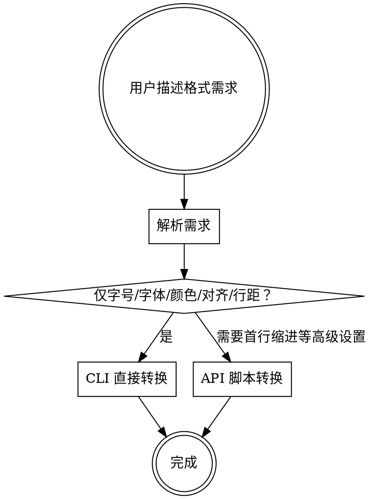

# md2word

将用户的中文字体、字号、颜色、间距需求映射为 `w2w` CLI 参数，直接导出 Word。优先使用 CLI 参数，仅当 CLI 无法覆盖需求时才使用 API 脚本。

---

## 前置条件

```bash
npm install -g @clipg/w2w
```

确认可用：

```bash
w2w --help
```

---

## 中文字号对照表

| 中文名 | 磅值(pt) | CLI 参数示例 |
|--------|---------|-------------|
| 初号 | 42 | `--h1-size 42` |
| 小初 | 36 | |
| 一号 | 26 | |
| 小一 | 24 | |
| 二号 | 22 | `--h1-size 22` |
| 小二 | 18 | |
| 三号 | 16 | `--h1-size 16` |
| 小三 | 15 | |
| 四号 | 14 | `--h2-size 14` |
| 小四 | 12 | `--body-size 12` |
| 五号 | 10.5 | `--body-size 10.5` |
| 小五 | 9 | |
| 六号 | 7.5 | |
| 七号 | 5.5 | |
| 八号 | 5 | |

---

## 字体映射

| 中文名 | 字体名 | CLI 参数 |
|--------|--------|---------|
| 宋体 | 宋体 | `--body-font "宋体"` |
| 黑体 | 黑体 | `--h1-font "黑体"` |
| 楷体 | 楷体 | |
| 仿宋 | 仿宋 | |
| 微软雅黑 | Microsoft YaHei | |
| Courier New | Courier New | |

`fontFamily` 直接使用中文名即可，docx 库会正确处理。

---

## 颜色映射

| 中文名 | 十六进制 | CLI 参数 |
|--------|---------|---------|
| 黑色 | 000000 | `--body-color "#000000"` |
| 白色 | FFFFFF | |
| 红色 | FF0000 | `--h1-color "#FF0000"` |
| 深红色 | 8B0000 | |
| 蓝色 | 0000FF | `--h2-color "#0000FF"` |
| 深蓝色 | 00008B | `--h2-color "#00008B"` |
| 浅蓝色 | ADD8E6 | |
| 绿色 | 008000 | |
| 深绿色 | 006400 | |
| 黄色 | FFFF00 | |
| 橙色 | FFA500 | |
| 紫色 | 800080 | |
| 灰色 | 808080 | |
| 深灰色 | A9A9A9 | |
| 浅灰色 | D3D3D3 | |
| 金色 | FFD700 | |

---

## CLI 参数速查

### 正文样式

| 参数 | 说明 |
|------|------|
| `--body-font <字体>` | 正文字体 |
| `--body-size <磅值>` | 正文字号 |
| `--body-color <颜色>` | 正文颜色 |

### 标题样式（h1-h4 均支持）

| 参数 | 说明 |
|------|------|
| `--h{N}-font <字体>` | 第 N 级标题字体 |
| `--h{N}-size <磅值>` | 第 N 级标题字号 |
| `--h{N}-color <颜色>` | 第 N 级标题颜色 |
| `--h{N}-bold` | 第 N 级标题加粗 |
| `--h{N}-center` | 第 N 级标题居中 |
| `--h{N}-align <对齐>` | 标题对齐（left/center/right/justify） |
| `--h{N}-spacing-before <值>` | 段前间距 |
| `--h{N}-spacing-after <值>` | 段后间距 |

### 全局

| 参数 | 说明 |
|------|------|
| `--line-height <倍数>` | 全文行间距倍数 |

---

## 用户需求映射规则

用户通常用中文称呼描述角色，映射到参数：

| 用户称呼 | 对应参数前缀 | Markdown 层级 |
|---------|-------------|--------------|
| 总标题 / 大标题 / 文章标题 | `--h1-*` | `# 一级标题` |
| 二级标题 / 章 / 节标题 | `--h2-*` | `## 二级标题` |
| 三级标题 / 小节 / 题目 | `--h3-*` | `### 三级标题` |
| 四级标题 | `--h4-*` | `#### 四级标题` |
| 正文 / 解答 / 内容 / 答案 | `--body-*` | 普通段落 |
| 全文 / 整体 | `--line-height` | 所有层级 |

---

## 间距换算

- **行间距**：直接填倍数（如 `--line-height 1.5`）
- **段前/段后间距**：单位为"行"，填数值（如 `--h1-spacing-before 0.5`），请勿自行换算磅值
- **首行缩进**：仅 API 支持（CLI 暂不支持 `--body-indent`）

---

## 执行流程



1. 解析用户的格式需求表或自然语言描述
2. 将中文字号转为 pt 值，颜色转为十六进制（如果颜色/字体不在映射表中，使用其标准名称或十六进制值）
3. 如果仅需字号、字体、颜色、对齐、行距 → 用 CLI 参数直接转换
4. 如果需要首行缩进等 CLI 不支持的高级设置：
   - 即使用户要求使用 CLI，也应优先使用 API 脚本
   - 向用户解释原因：CLI 暂不支持此功能
   - 如用户坚持使用 CLI，告知该功能将被跳过
5. 告知用户生成的 docx 文件路径

---

## 示例

### 课程作业（CLI）

用户需求：`标题｜三号黑体，题目｜五号黑体深蓝色，解答｜五号宋体黑色，全文｜1.5倍行间距`

根据映射规则：标题 → h1，题目 → h3，解答 → body

```bash
w2w demo.md output.docx \
  --h1-font "黑体" --h1-size 16 --h1-center \
  --h3-font "黑体" --h3-size 10.5 --h3-color "#00008B" \
  --body-font "宋体" --body-size 10.5 --body-color "#000000" \
  --line-height 1.5
```

### 学位论文（API 脚本，需要首行缩进）

用户需求：正文宋体小四首行缩进2字符，标题黑体，1.5倍行距

```typescript
import * as fs from 'fs';
import { convertMdToDocx } from '@clipg/w2w';

const formatSettings = {
  paragraph: {
    fontFamily: '宋体', fontSize: 12, lineHeight: 1.5,
    paragraphSpacing: 0.5, firstLineIndent: 2, color: '000000',
  },
  heading1: {
    fontFamily: '黑体', fontSize: 16, lineHeight: 1.5,
    alignment: 'center', spacingBefore: 0.5, spacingAfter: 0.5,
  },
  heading2: {
    fontFamily: '黑体', fontSize: 14, lineHeight: 1.5,
    alignment: 'left', spacingBefore: 0.5, spacingAfter: 0.5,
  },
  heading3: {
    fontFamily: '黑体', fontSize: 13, lineHeight: 1.5,
    alignment: 'left', spacingBefore: 0.5, spacingAfter: 0.5,
  },
  heading4: {
    fontFamily: '黑体', fontSize: 12, lineHeight: 1.5,
    alignment: 'left', spacingBefore: 0.5, spacingAfter: 0.5,
  },
};

const md = fs.readFileSync('INPUT.md', 'utf-8');
const buf = await convertMdToDocx(md, { formatSettings, sourceFilePath: 'INPUT.md' });
fs.writeFileSync('OUTPUT.docx', buf);
```

执行：`npx tsx convert.ts`

---

## API FormatSettings 结构（高级用法）

```typescript
interface FormatSettings {
  paragraph: {
    fontFamily: string;
    fontSize: number;          // pt
    lineHeight: number;        // 倍数
    paragraphSpacing: number;  // 段后间距(行)
    firstLineIndent: number;   // 首行缩进(字符数)
    color?: string;            // 十六进制,无#
  };
  heading1: {
    fontFamily: string;
    fontSize: number;
    lineHeight: number;
    alignment: 'left' | 'center' | 'right' | 'justify';
    spacingBefore: number;     // 段前间距(行)
    spacingAfter: number;      // 段后间距(行)
    color?: string;
    bold?: boolean;
  };
  heading2: { /* 同 heading1 */ };
  heading3: { /* 同 heading1 */ };
  heading4: { /* 同 heading1 */ };
}
```
