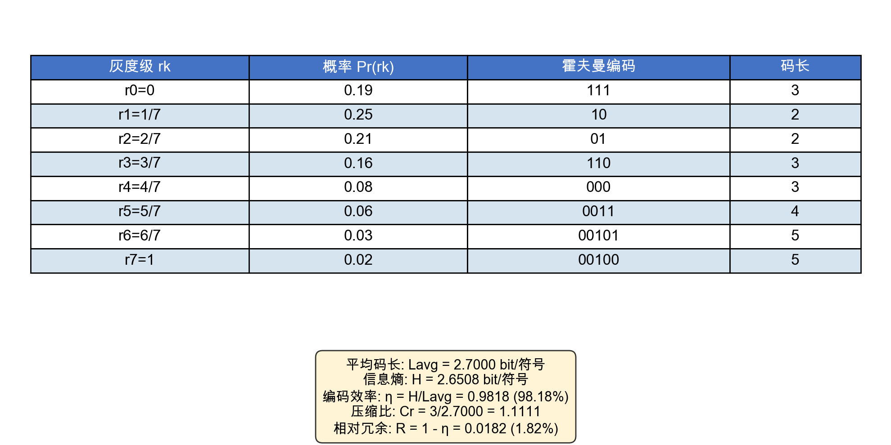
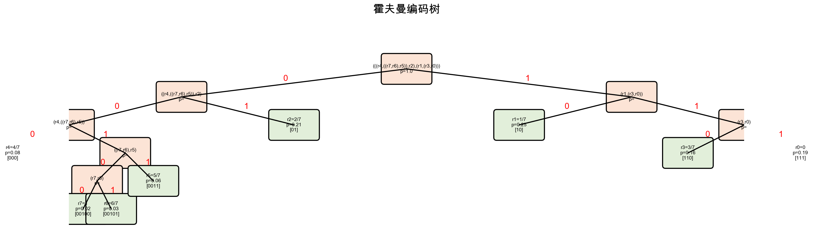
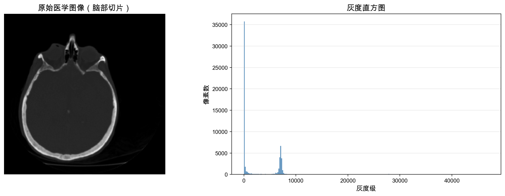
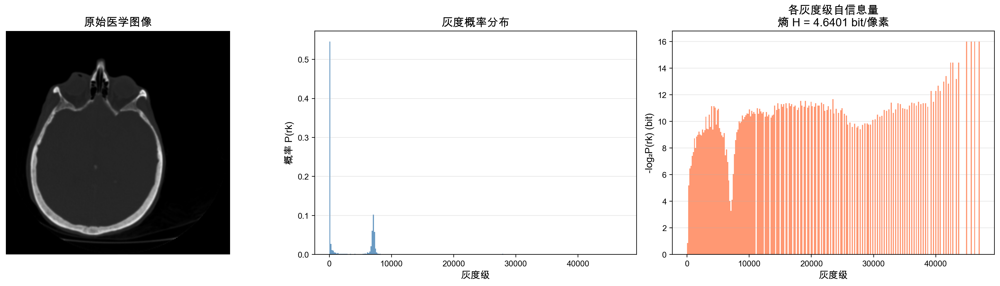

# 数字图像处理作业

## 一、霍夫曼编码

对一幅有8个灰度级的图像，各灰度级概率分布如下表所示，对其进行霍夫曼编码，并计算压缩比和相对冗余。

### 1.1 灰度级概率分布

| 灰度级 $r_k$ | 概率 $P_r(r_k)$ |
| :-------: | :-----------: |
|     0     |      0.19     |
|    1/7    |      0.25     |
|    2/7    |      0.21     |
|    3/7    |      0.16     |
|    4/7    |      0.08     |
|    5/7    |      0.06     |
|    6/7    |      0.03     |
|     1     |      0.02     |

### 1.2 霍夫曼编码过程

按照霍夫曼编码算法，每次选取概率最小的两个符号合并，直到只剩一个根节点。编码结果如下：

| 灰度级 $r_k$ | 概率 $P_r(r_k)$ | 霍夫曼编码 | 码长 |
| :-------: | :-----------: | :-------: | :--: |
|     1/7   |     0.25      |    10     |  2   |
|    2/7    |     0.21      |    01     |  2   |
|     0     |     0.19      |    111    |  3   |
|    3/7    |     0.16      |    110    |  3   |
|    4/7    |     0.08      |    000    |  3   |
|    5/7    |     0.06      |   0011    |  4   |
|    6/7    |     0.03      |   00101   |  5   |
|     1     |     0.02      |   00100   |  5   |



### 1.3 霍夫曼编码树



### 1.4 计算结果

**（1）平均码长：**

$$L_{avg} = \sum_{k=0}^{7} l_k \cdot P_r(r_k) = 2 \times 0.25 + 2 \times 0.21 + 3 \times 0.19 + 3 \times 0.16 + 3 \times 0.08 + 4 \times 0.06 + 5 \times 0.03 + 5 \times 0.02 = 2.70 \text{ bit/符号}$$

**（2）信息熵：**

$$H = -\sum_{k=0}^{7} P_r(r_k) \cdot \log_2 P_r(r_k) = 2.6508 \text{ bit/符号}$$

**（3）编码效率：**

$$\eta = \frac{H}{L_{avg}} = \frac{2.6508}{2.70} = 98.18\%$$

**（4）压缩比：**

8个灰度级用等长编码需要3 bit（$\lceil \log_2 8 \rceil = 3$），霍夫曼编码后平均码长为 2.70 bit：

$$C_r = \frac{n}{L_{avg}} = \frac{3}{2.70} \approx 1.111$$

**（5）相对冗余：**

$$R = 1 - \eta = 1 - 0.9818 = 1.82\%$$

## 二、医学图像处理程序

编写程序，读取一张二维医学图像，完成以下任务。

### 2.1 灰度直方图

使用 scikit-image 库中的脑部医学切片图像（uint16 类型，$256 \times 256$ 像素），计算并绘制灰度直方图如下：



### 2.2 信息熵与理论无损压缩极限

根据信息熵公式：

$$H = -\sum_{k=0}^{L-1} P(r_k) \cdot \log_2 P(r_k)$$

其中 $P(r_k)$ 为灰度级 $r_k$ 出现的概率。计算得到：

- 图像共有 65536 个像素（$256 \times 256$）
- 有效灰度级数：214
- **信息熵 H = 4.6401 bit/像素**

这意味着该图像的理论无损压缩极限为：每个像素至少需要 **4.6401 bit** 来表示，不能低于此值进行无损编码。

### 2.3 综合分析结果



### 2.4 16位图像最大无损压缩比

若该图像原始为16位深度，则每个像素占用 16 bit。最大无损压缩比为：

$$C_r = \frac{\text{原始 bpp}}{H} = \frac{16}{4.6401} \approx 3.45$$

即理论上最大无损压缩比约为 **3.45 : 1**。

### 2.5 完整代码

```python
"""医学图像处理 - 灰度直方图、信息熵、压缩比"""
import matplotlib.pyplot as plt
import numpy as np
from skimage import data

# 读取脑部医学图像（uint16）
volume = data.brain()
image = volume[5]  # 取中间切片

# 1. 计算灰度直方图
hist, bin_edges = np.histogram(image.flatten(), bins=256)
hist_prob = hist / image.size

# 绘制直方图
plt.figure(figsize=(8, 5))
plt.bar(bin_centers, hist, color='steelblue')
plt.title('灰度直方图')
plt.xlabel('灰度级')
plt.ylabel('像素数')
plt.savefig('histogram.png', dpi=200)

# 2. 计算信息熵
unique_vals, counts = np.unique(image.flatten(), return_counts=True)
probs = counts / image.size
entropy = -np.sum(probs * np.log2(probs))
print(f"信息熵 H = {entropy:.4f} bit/像素")

# 3. 计算最大无损压缩比（16位）
compression_ratio = 16 / entropy
print(f"最大无损压缩比: {compression_ratio:.2f}:1")
```
